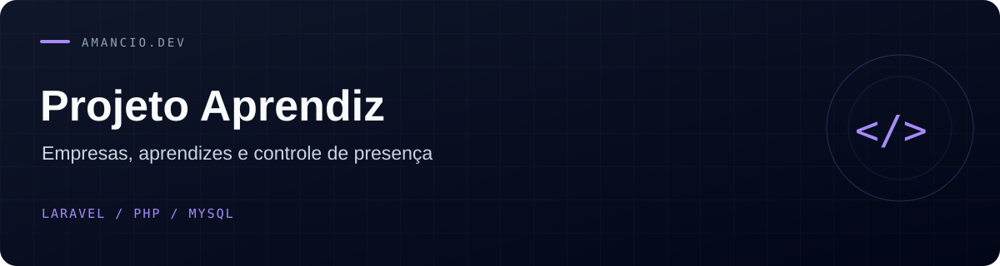

<div align="center">

# 🎓 Projeto Aprendiz

**Sistema de gerenciamento de aprendizes com controle de presença e multi-autenticação**

[](https://php.net)
[](https://laravel.com)
[](https://mysql.com)

</div>

---

## 📋 Sobre o projeto

O **Projeto Aprendiz** é um sistema web para gerenciamento de jovens aprendizes, desenvolvido com **Laravel 13**. Conecta três partes envolvidas no Programa Jovem Aprendiz:

- **Empresas** contratantes, que cadastram seus aprendizes e aprovam pontos de presença
- **Instituições de ensino** vinculadas às empresas e turmas
- **Aprendizes**, que registram sua presença com geolocalização via GPS

O projeto foi originalmente desenvolvido em **PHP puro com PDO** e migrado para Laravel como exercício de modernização de código legado, incluindo correção de vulnerabilidades de segurança do projeto original.

---

## ✨ Funcionalidades

### 🔑 Administrador
- Dashboard com estatísticas gerais do sistema
- CRUD completo de empresas, aprendizes e instituições de ensino
- Gerenciamento de outros administradores
- Aprovação e rejeição de pontos de qualquer empresa

### 🏢 Empresa
- Dashboard com resumo dos próprios aprendizes e pontos pendentes
- CRUD de aprendizes e instituições vinculadas à empresa
- Aprovação e rejeição de pontos dos próprios aprendizes
- Edição do próprio perfil e credenciais

### 🎓 Aprendiz
- Registro de ponto com captura de **GPS via HTML5 Geolocation**
- Mapa interativo exibindo a localização capturada (Leaflet.js + OpenStreetMap)
- Histórico de pontos com filtro por status (pendente / aprovado / rejeitado)

---

## 🛡️ Segurança

Este projeto corrige quatro vulnerabilidades confirmadas no código PHP original:

| Vulnerabilidade | Original | Laravel |
|---|---|---|
| Controle de acesso por perfil | Só verifica se está logado, nunca verifica o tipo | 3 guards isolados + middleware `role` por rota |
| IDOR em aprovação de ponto | `id_ponto` vinha do GET sem verificar o dono | `abort_if` garante que o ponto pertence à empresa logada |
| IDOR na edição de empresa | `id_empresa` vinha do GET, não da sessão | ID sempre obtido do guard autenticado, nunca do request |
| Hashing de senha | SHA1 sem salt | bcrypt via `Hash::make()` |

---

## 🚀 Stack

| Tecnologia | Uso |
|---|---|
| Laravel 13 | Framework PHP |
| Eloquent ORM | Models e relacionamentos |
| Multi-guard Auth | Sessões isoladas por tipo de usuário |
| Blade | Templates |
| AdminLTE 3 | Interface administrativa (via CDN) |
| DataTables | Tabelas com busca e paginação (via CDN) |
| Leaflet.js | Mapa de geolocalização |
| OpenStreetMap | Tiles do mapa (gratuito, sem API key) |
| MySQL 8+ | Banco de dados |
| PHPUnit | Testes |

---

## ⚙️ Instalação

### Pré-requisitos
- PHP >= 8.3
- Composer
- MySQL >= 8.0

### Passo a passo

```bash
# 1. Clone o repositório
git clone https://github.com/seu-usuario/projetoaprendiz-laravel.git
cd projetoaprendiz-laravel

# 2. Instale as dependências
composer install

# 3. Configure o ambiente
cp .env.example .env
php artisan key:generate
```

Edite o `.env` com as credenciais do seu banco:

```env
DB_CONNECTION=mysql
DB_HOST=127.0.0.1
DB_PORT=3306
DB_DATABASE=projetoaprendiz
DB_USERNAME=seu_usuario
DB_PASSWORD=sua_senha
```

```bash
# 4. Crie o banco de dados
mysql -u seu_usuario -p -e "CREATE DATABASE projetoaprendiz CHARACTER SET utf8mb4 COLLATE utf8mb4_unicode_ci;"

# 5. Rode as migrations e o seeder (popula com dados de exemplo)
php artisan migrate:fresh --seed

# 6. Inicie o servidor
php artisan serve
```

Acesse **http://127.0.0.1:8000** 🎉

> **MySQL/MariaDB mais antigo?** Se aparecer erro de collation, abra `config/database.php` e troque `utf8mb4_0900_ai_ci` por `utf8mb4_unicode_ci` na conexão `mysql`.

---

## 🔑 Credenciais de acesso (ambiente de desenvolvimento)

| Tipo | E-mail | Senha |
|---|---|---|
| Administrador | admin@projetoaprendiz.com | senha123 |
| Empresa | senac@senac.com | senha123 |
| Empresa | sescs@sescs.com | senha123 |
| Aprendiz | aluno1@aluno.com | senha123 |
| Aprendiz | aluno2@aluno.com | senha123 |
| Aprendiz | aluno3@aluno.com | senha123 |

---

## 🧪 Testes

```bash
php artisan test
```

A suíte cobre:

- **`LoginTest`** — login nos 3 guards, senha errada, guard errado (aluno tentando logar como empresa)
- **`RoleMiddlewareTest`** — visitante bloqueado, cross-guard bloqueado (empresa tentando acessar área de admin)
- **`EmpresaOwnershipTest`** — empresa não consegue editar, excluir ou aprovar ponto de outra empresa (cobre exatamente as falhas de IDOR do projeto original)

---

## 📁 Estrutura do projeto

```
app/Http/Controllers/
├── AuthController.php               # Login / logout (3 tipos)
├── Auth/PasswordResetController.php # Recuperação de senha por guard
├── Admin/     Dashboard · Admins · Empresas · Alunos · Instituições · Pontos
├── Empresa/   Dashboard · Perfil · Alunos · Instituições · Pontos
└── Aluno/     Dashboard · Ponto (registrar + histórico)

app/Models/          Admin · Empresa · Aluno · InstituicaoEducacao · Ponto
app/Middleware/      CheckRole          (protege rotas por guard)
app/Notifications/   ResetPasswordNotification (e-mail de reset por guard)

database/migrations/ 6 arquivos  (5 tabelas + tokens de reset por guard)
database/factories/  4 arquivos  (Admin, Empresa, Aluno, InstituicaoEducacao)
database/seeders/    DatabaseSeeder.php

resources/views/
├── auth/    login · forgot-password · reset-password
├── layouts/ app.blade.php (AdminLTE, sidebar dinâmica por perfil)
├── admin/   dashboard · admins · empresas · alunos · instituicoes · pontos
├── empresa/ dashboard · perfil · alunos · instituicoes · pontos
└── aluno/   dashboard · ponto/registrar · ponto/historico

routes/web.php       Rotas organizadas em grupos por guard (admin / empresa / aluno)
tests/Feature/       3 arquivos, 12 testes
```

---

## 🗺️ Rotas principais

```
/                     → redireciona para /login
/login                GET  Tela de login (seleciona tipo + credenciais)
/esqueci-senha        GET  Formulário de recuperação de senha
/redefinir-senha      GET  Formulário de nova senha

/admin/dashboard      Painel do administrador
/admin/admins         CRUD de administradores
/admin/empresas       CRUD de empresas
/admin/alunos         CRUD de aprendizes
/admin/instituicoes   CRUD de instituições
/admin/pontos         Listagem e aprovação de todos os pontos

/empresa/dashboard    Painel da empresa
/empresa/perfil       Edição do próprio cadastro
/empresa/alunos       CRUD dos próprios aprendizes
/empresa/instituicoes CRUD das próprias instituições
/empresa/pontos       Aprovação dos pontos da empresa

/aluno/dashboard      Painel do aprendiz
/aluno/ponto/registrar   Registrar ponto com GPS
/aluno/ponto/historico   Histórico de pontos
```

---

## 🤝 Contribuindo

1. Faça um fork do projeto
2. Crie uma branch para sua feature (`git checkout -b feature/minha-feature`)
3. Faça commit das alterações (`git commit -m 'feat: minha feature'`)
4. Faça push para a branch (`git push origin feature/minha-feature`)
5. Abra um Pull Request

---

## 📄 Licença

Este repositório ainda não contém um arquivo de licença. Consulte o responsável pelo projeto antes de reutilizar ou distribuir o código.
